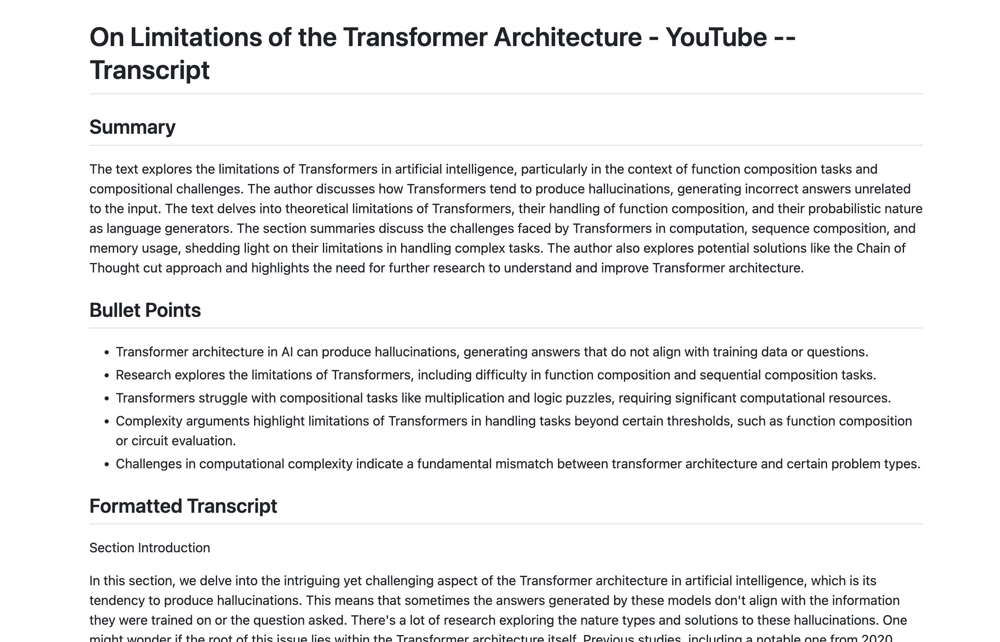
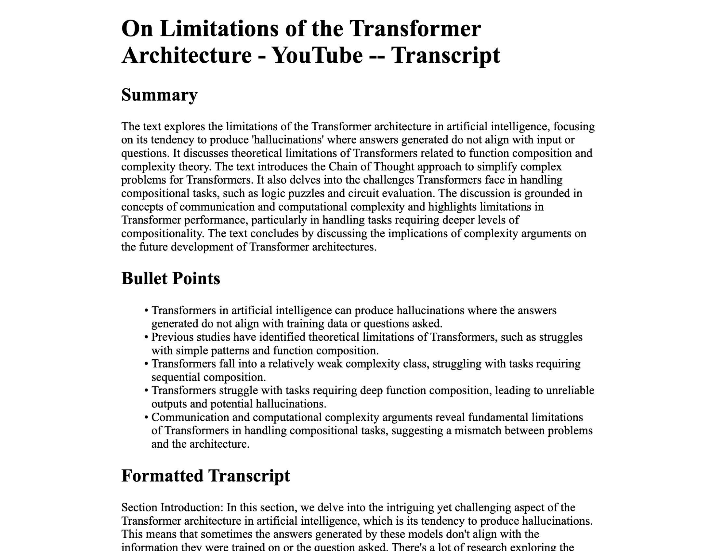

<div align="center">
  <br />
    
  <br />
  <h2>Youtube <> LLMs</h2>
  <h4>Minimalistic and customizable API to transcript Youtube videos along with LLM-powered summaries, chapters, and analysis.</h4>
</div>


## 📙 Overview
Foundational blocks to interact with Youtube API and LLMs to transcribe, summarize, and analyze Youtube videos. The API is designed to be minimal and customizable, allowing for easy integration with other services and APIs.
<br />

## ⚙️ Setup and Installation

1. Clone the repository: 
```
git clone https://github.com/technoabsurdist/yb-transcript.git
cd yb-transcript
```

### Easy Setup
2. Run shell script: 
```
chmod +x run.sh
./run.sh
```

### Or, Manual Setup

2. Install requirements: 
```
pip install -r requirements.txt
```
3. Set up the environment variables (`.env.example` file available): 
```
OPENAI_API_KEY=YOUR_API_KEY
```

4. Run the server: 
```
python client.py
```

<br />

## 🎢  Main Attraction!
Markdown/PDF formatted document with title, summary, bullet points and full transcript. <br />
Example from `/example_outputs`:
<br />
<div align="center">
  
  
</div>


## 🧱 Individual Features

* **Summary Generation**: Condenses the video transcript into a short, comprehensive summary.
* **Bullet Points Generation**: Extracts key points from the transcript and presents them in bullet-point format.
* **Transcription Formatting**: Improves the readability of the raw transcript by adding punctuation and paragraph breaks.


## 💻 API Endpoints
**IMPORTANT:** For each endpoint choose to either pass in the Youtube video ID or the video URL. 

<br />

1. 🎢 **Markdown/PDF Download** <br />
* Description: Returns a markdown/pdf formatted document with title, summary, bullet points and full transcript.
* Method: GET
* Query Parameters:
* video_id: The YouTube video ID.
* video_url: The YouTube video URL.
* format: The format of the document. Choose from 'md' or 'pdf'. (Default: 'md') <br />
```
curl "http://localhost:5000/markdown?video_id=YOUR_VIDEO_ID"
```
Example Request with video URL:
```
curl "http://localhost:5000/markdown?video_url=YOUR_VIDEO_URL"
```

<br /> 

----------------

<br /> 

2. **Summary Endpoint** <br />
* Description: Returns a summary of the YouTube video's transcript.
* Method: GET
* Query Parameters:
* video_id: The YouTube video ID.
* video_url: The YouTube video URL. <br />
```
curl "http://localhost:5000/summary?video_id=YOUR_VIDEO_ID"
```

<br /> 

----------------

<br />

3. **Bullet Points Endpoint** <br />
* Description: Returns bullet points of the YouTube video's transcript.
* Method: GET
* Query Parameters:
* video_id: The YouTube video ID.
* video_url: The YouTube video URL. <br />
```
curl "http://localhost:5000/bullet_points?video_id=YOUR_VIDEO_ID"
```

<br />

----------------

<br />

4. **Transcript Endpoint** <br />
* Description: Returns the transcript of the YouTube video.
* Method: GET
* Query Parameters:
* video_id: The YouTube video ID.
* video_url: The YouTube video URL. <br />
```
curl "http://localhost:5000/transcript?video_id=YOUR_VIDEO_ID"
```


